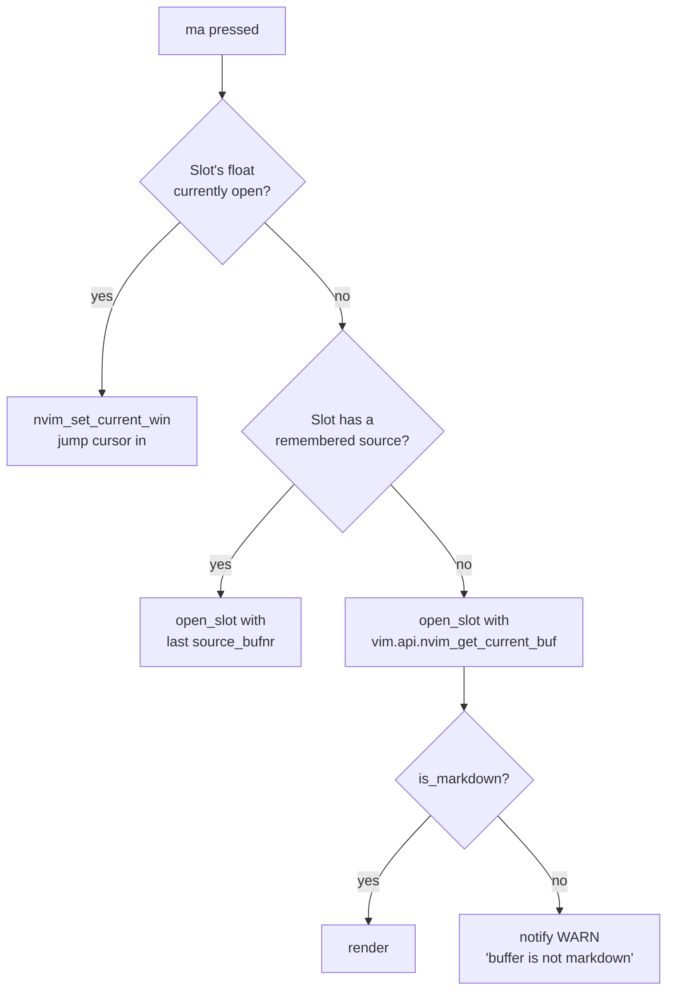
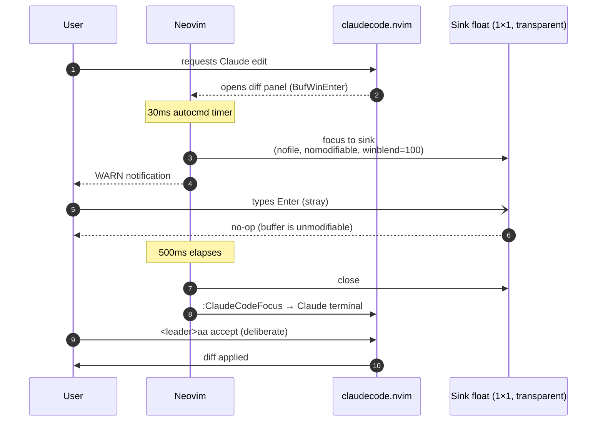
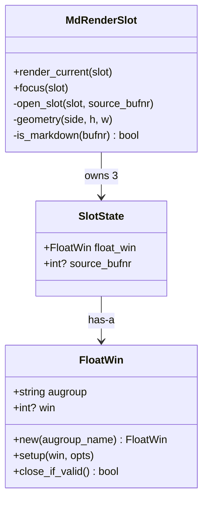
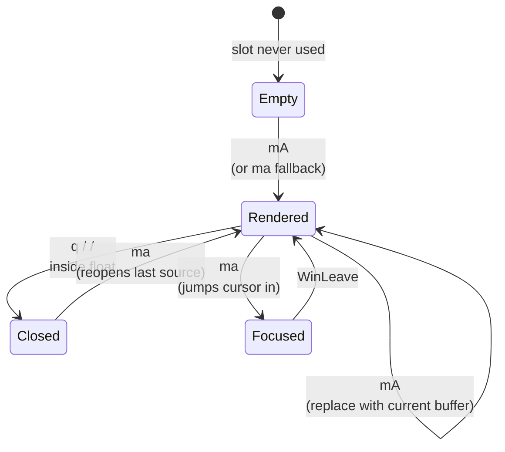

# Mermaid render sample

**Tags:** `type:reference` `area:test-fixture` `tool:md-render` `living-doc`

**Abstract:** A md-render exercise file: every markdown feature the plugin renders specially (callouts, tables, fenced code with treesitter, OSC 8 links, GitHub-style alerts, and four Mermaid diagram types). Useful for visually verifying that mmdc + the Kitty graphics protocol path actually work end-to-end after dep changes.

- **Created:** 2026-04-24
- **Open with:** `<leader>ms` (slot middle) or `<leader>mt` (full-screen tab) on this buffer
- **Mermaid prerequisite:** `mmdc` on `$PATH` (`npm install -g @mermaid-js/mermaid-cli` or `yay -S mermaid-cli`). Without it, md-render falls back to `npx -y @mermaid-js/mermaid-cli`, which is correct but slow on first run

## Inline formatting smoke test

This paragraph has **bold**, *italic*, ***both***, `inline code`, ~~strikethrough~~, and an [external link](https://github.com/delphinus/md-render.nvim) to make sure OSC 8 hyperlinks light up under Ghostty.

## Callouts

> [!NOTE]
> A plain note callout. Should render with a colored left bar and an icon in the heading.

> [!TIP]
> Tip callouts are nice for rendering verification because they exercise the green/teal palette.

> [!WARNING]
> Warning callouts catch the eye — useful to confirm color blending on top of the float background.

> [!CAUTION]
> Red caution callouts. The `MdRenderAlertCaution` highlight group fades the bar fg into the background at 0.1 alpha; if that looks muddy on your theme, that's the place to tweak.

## Code blocks (treesitter)

```lua
-- Lua block. Should pick up @keyword / @function / @string etc.
local function preview_side(side)
  return function()
    require("md-render").preview.show()
    local win = vim.api.nvim_get_current_win()
    if vim.api.nvim_win_get_config(win).relative ~= "" then
      vim.api.nvim_win_set_config(win, { col = 4 })
    end
  end
end
```

```go
package main

import "fmt"

func main() {
    fmt.Println("Go highlighting ✓")
}
```

```typescript
type Slot = "a" | "s" | "d";

const focus = (slot: Slot): void => {
  console.log(`focus ${slot}`);
};
```

## Tables

| Tool | Purpose | Required? |
|---|---|---|
| `ffmpeg` | JPEG/WebP → PNG, video frame extraction | Optional (images / video) |
| ImageMagick | Same conversions; ffmpeg fallback | Optional |
| `mmdc` | Render Mermaid blocks to PNG | Required for **this** file's diagrams |

## Mermaid: flowchart

The 3-slot manager's `M.focus(slot)` decision tree:



## Mermaid: sequence diagram

How the claudecode diff-panel keystroke sink defangs an accidental Enter:



## Mermaid: class diagram



## Mermaid: state diagram



## What to look for

- Mermaid blocks render as inline images (Kitty graphics) or fall back to a styled code block if `mmdc` and `npx` are both unavailable.
- Tables draw with box-drawing borders, not `|` characters.
- Callouts have colored left bars with icons in the title row.
- Code blocks have language icons in their headers (via nvim-web-devicons).
- The `[external link](...)` clicks open in your browser if your terminal supports OSC 8.

If any of those don't appear, check `:checkhealth md-render` (if exposed) or grep the plugin's renderer for the relevant feature flag.
