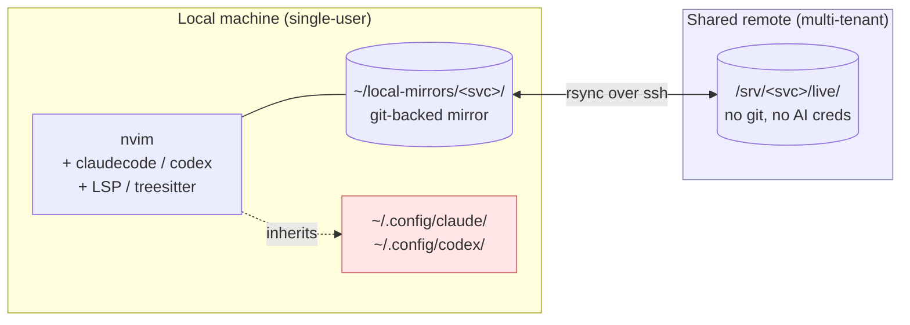
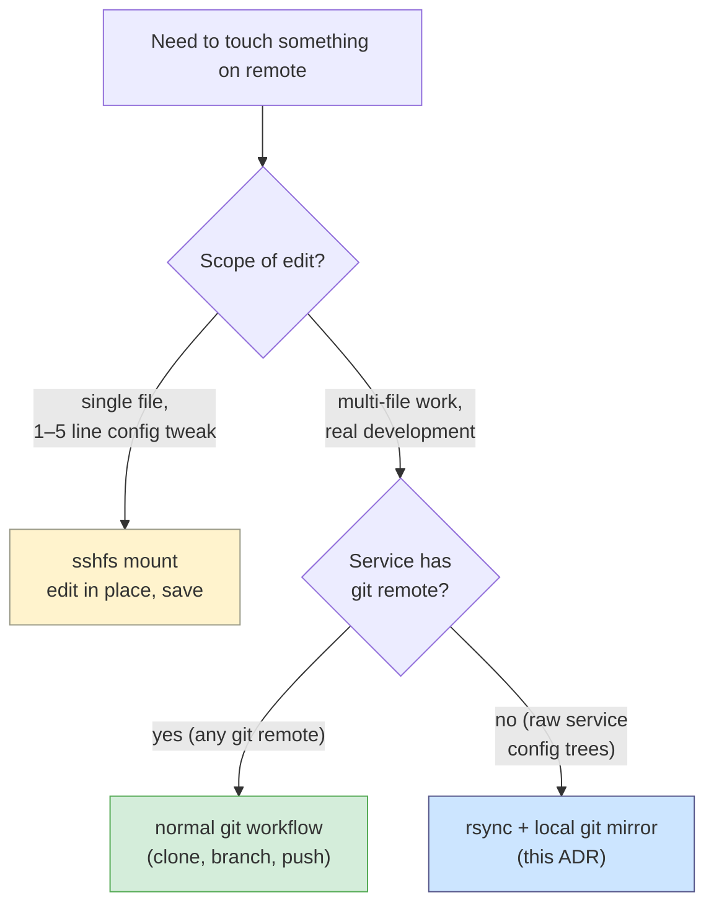

# Remote Dev: Local-First With Git-Backed Sync

**Tags:** `type:adr` `repo:autovim` `area:remote-dev` `area:remote-sync` `area:plugin-architecture` `status:in-progress` `adr:2026-04-25`

**Abstract:** AutoVim needs a remote development workflow against a shared production box hosting self-hosted team services (groupware, file-share, secrets manager, planned self-hosted git host) without leaving Claude/Codex AI credentials on the multi-tenant remote. Evaluated `distant.nvim` (alpha, last release 2021) and `remote-nvim.nvim` (active but runs nvim *on* remote, same credential exposure). Chose a local-first model: nvim runs locally with full AI/LSP, files are synced via rsync into a persistent git-backed local mirror per service, with sshfs reserved for small live-config edits. Implementation deferred to follow-up branch.

- **Date:** 2026-04-25
- **References:**
  - https://github.com/chipsenkbeil/distant.nvim
  - https://distant.dev
  - https://github.com/amitds1997/remote-nvim.nvim
- **Scope:** Editor-side workflow for editing files on a shared remote without exporting AI tooling credentials. Out of scope: orchestration of the deployed services themselves; production change-management policy; CI/CD wiring.

## Context

The motivating constraint is **credential isolation**. The remote box is shared with the team and slated to host more self-hosted services (a groupware suite, a file-share service, a secrets manager, a planned self-hosted git host). Logging `claude` or `codex` into that box would persist long-lived AI credentials in `~/.config/claude/` (or equivalent) on a multi-tenant machine — a security and audit posture we want to avoid.

The remote also has heterogeneous content:

- **Service config trees** (e.g. service-managed `data/` and `config/` subtrees that the upstream project owns) are not git-tracked and cannot easily be made into git working trees on the live machine without process changes nobody has agreed to.
- **Source code** is being moved to a self-hosted git host on the same box; once that's available, source files belong in proper git repos with normal push/pull. Until then, even some source lives in non-git directories.
- **Live runtime configs** (small, edited rarely, sometimes urgent) are a minority case — speed of edit matters more than full LSP/AI ergonomics.

Existing AutoVim plugins are local-fs assuming:

- `claudecode.nvim` spawns the Claude Code CLI as a child process; that CLI does filesystem operations on the local fs and inherits local credentials.
- `codex.nvim` same shape.
- `lazysql`, `neo-tree`, telescope file finders, LSP root_dir detection — all assume real local paths.

Any architecture that runs nvim on the remote inherits the credential problem. Any architecture that proxies files to a local nvim must still produce paths the AI CLIs can operate on.

### Architecture at a glance



AI tooling and credentials never cross the boundary. Files do.

## Decisions

### 1. Local-first development with git-backed local mirrors per service

Decision:

- Run nvim locally. AI plugins, LSP, treesitter all stay local.
- For each service we want to edit, maintain a **persistent local mirror** at `~/local-mirrors/<service>/` (or similar; final path TBD per user preference).
- The mirror is a real git repo: `git init` once, the first commit after each `rsync` pull is the snapshot baseline.

Why:

- Nvim runs locally → AI CLIs inherit local credentials → no creds on the shared box.
- Git on the local mirror gives per-file conflict detection, real merge tooling, full history, branch-based exploration, and rollback — all "free" — without the remote ever knowing git exists.
- The mirror is persistent, not single-use. Each successful round leaves the latest commit as the next round's snapshot baseline. Deleting it forfeits drift detection and audit history.

Cost / tradeoff:

- A discipline cost: the user has to remember to `git commit` after pulling and after editing. Implementation should make that automatic where possible.
- Storage cost on the local machine — fine for service config trees, would be wrong for service *data* dirs (databases, caches). The pattern is intended for config trees and source files; data dirs are explicitly out of scope.

### 2. rsync as the transport, with a strict pre-push drift check

Decision:

- **Pull:** `rsync -az --exclude=<list> host:/path/live/ ~/local-mirrors/<svc>/`
- **Pre-push check:** `rsync -azn --checksum host:/path/live/ ~/local-mirrors/<svc>/` — `-n` dry-run, `--checksum` for byte-accurate detection. Any output means the remote has drifted from our last known snapshot.
- **No drift:** push via `rsync -az --delete-after ~/local-mirrors/<svc>/ host:/path/live/`. `--delete-after` is intentional over `--delete`: it removes deletions only after a successful transfer, so a failed push doesn't half-delete remote state.
- **Drift:** branch off, rsync pull into a `snap-update` branch, commit (this is the new snapshot of remote state), checkout the work branch, `git merge snap-update` (or rebase), resolve conflicts in nvim with full LSP/AI help, re-run pre-push check, push.

Why:

- rsync is universally available, well-understood, and idempotent.
- `--checksum` over `--size-only` (the rsync default for `-a`) — small files often change without changing size, and checksum is the only honest drift signal.
- `--delete-after` over `--delete` matters specifically for the failure case; the modest extra disk pressure on the remote during transfer is acceptable.

Cost / tradeoff:

- TOCTOU race: between the dry-run check and the real push, another admin could land changes. Same race git has between `fetch` and `push`. Inherent to optimistic concurrency control. Documented, not eliminated.
- Build artifacts and ephemeral files need explicit excludes early — once they leak into the mirror, they round-trip on every push.
- File ownership/perms preservation needs care. `rsync -a` preserves uid/gid; on cross-user pushes (mirror owned by your local user, remote owned by a service account such as `www-data`) we want `--no-owner --no-group --chown=...` or equivalent.

#### Happy path: pull, edit, push (no drift)

```mermaid
sequenceDiagram
    autonumber
    participant U as User (nvim)
    participant L as Local mirror (git)
    participant R as Remote /srv/svc/live/

    U->>L: &lt;leader&gt;rp  (pull)
    L->>R: rsync -az --exclude=...
    R-->>L: files
    L->>L: git add -A && git commit -m "snap"
    Note over U,L: edit + commit cycles<br/>(full local LSP / AI)
    U->>L: &lt;leader&gt;rd  (precheck)
    L->>R: rsync -azn --checksum
    R-->>L: no output → no drift
    U->>L: &lt;leader&gt;rs  (push)
    L->>R: rsync -az --delete-after
    R-->>L: ok
    Note over L: HEAD = new snapshot baseline
```

#### Drift detected: pull-merge-push

```mermaid
sequenceDiagram
    autonumber
    participant U as User
    participant L as Local mirror
    participant R as Remote

    U->>L: &lt;leader&gt;rd  (precheck)
    L->>R: rsync -azn --checksum
    R-->>L: DRIFT  (teammate edited)
    L->>L: git branch snap-update
    L->>R: rsync pull → snap-update
    R-->>L: drifted state
    L->>L: git commit on snap-update
    L->>L: git checkout work<br/>git merge snap-update
    Note over U,L: resolve conflicts in nvim<br/>with full LSP / AI help
    U->>L: &lt;leader&gt;rs  (push, re-runs precheck)
    L->>R: rsync -az --delete-after
    R-->>L: ok
```

### 3. sshfs reserved for live-config edits, not full development

Decision:

- For small, infrequent live-config touch-ups (edit one file in a running service's config dir, save, done), use `sshfs` mount of the relevant remote dir.
- Do not use sshfs as the primary development surface.

Why:

- sshfs gives "follow changes" UX with no explicit sync ceremony — every read/write is over the wire.
- For a 5-line edit in a single config file, the rsync round-trip is overhead.
- Performance cliffs make it wrong as the default: LSP indexing across a FUSE mount is slow, large file trees feel sluggish, dropped SSH connections produce confusing errors.

Cost / tradeoff:

- Two workflows for users to internalize (rsync mirror vs sshfs mount). Documentation should make it clear which to reach for.

#### Picking the right tool



### 4. AutoVim ships a thin Lua helper, not a heavyweight plugin

Decision (architectural):

- A single `lua/utils/remote_sync.lua` providing `push`, `pull`, `precheck`, `status`, `log`. ~150 lines target.
- A single `lua/plugins/remote-sync.lua` wiring keymaps under the `<leader>r` namespace and which-key descs.
- Per-project config in `<cwd>/.autovim-remote.json` (gitignored), schema:

```json
{
  "host": "user@example.com",
  "remote_path": "/srv/svc",
  "exclude": [".git", "node_modules", "vendor", ".direnv"],
  "delete": true
}
```

- Project root resolution via `vim.fs.find` walking up from cwd. No host configured → `M.push()` notifies and no-ops, so keymaps are safe to invoke from any buffer.
- v1 keymaps: `<leader>rs` push (with implicit precheck, refuses on drift unless forced), `<leader>rp` pull (with confirm prompt, destructive), `<leader>rd` drift report, `<leader>rc` configured remote command, `<leader>rl` last-sync log float.
- v1 feedback channel: `vim.notify` only. Last-sync state persisted at `vim.fn.stdpath("state") .. "/autovim-remote/<sha1-of-cwd>.json"` for `M.status()`.

Why:

- Workflow primitives exist (`rsync`, `git`, `ssh`); we only need ergonomic editor-side wiring.
- A thin helper is easier to maintain across the three AutoVim branches (main, mac-os, omarchy) and avoids vendoring a third-party plugin whose update cadence we don't control.
- Notify-only feedback in v1 is the minimal viable shape; lualine/statusline integration can layer on top without changing the core API.

Cost / tradeoff:

- Reinvention of features distant.nvim/remote-nvim.nvim provide. Acceptable because their architectures don't match the credential constraint and we don't want most of their feature surface.

### 5. Land on `main` branch; mac-os and omarchy inherit

Decision:

- Implement on `main`. Verify `<leader>r` namespace is unused on all three branches before wiring keymaps.
- Mac-os and omarchy gain the feature by rebasing on the next `main` cut.

Why:

- The feature is OS-agnostic at the editor layer — it shells out to `rsync`, `ssh`, `git`. Whatever exists on the user's PATH is what runs.
- Branch-specific concerns (Linux PipeWire vs macOS CoreAudio, Hyprland vs macOS window management) are absent here.

## Files Touched / Created

No code changed in this round — this is a design-decision record. Future implementation will create:

| File | Action | Purpose |
|---|---|---|
| `lua/utils/remote_sync.lua` | create | core: config load, push, pull, precheck, status, log |
| `lua/plugins/remote-sync.lua` | create | keymaps under `<leader>r` + which-key labels |
| `README.md` | edit | "Remote development" section: schema, security note, sshfs vs rsync guidance |
| `.gitignore` snippet (in README) | document | flag `.autovim-remote.json` as a gitignore candidate per-project |

## Alternatives Considered

### `distant.nvim`

Pros:

- Architecturally the closest fit: local nvim, remote files via custom protocol. AI plugins would inherit local credentials.
- Has LSP forwarding (with caveats per server).

Cons:

- Author labels it "Alpha stage software" front and center.
- Latest tagged release is **v0.1.2 from November 2021** — 4.5 years old at the time of this decision.
- Sparse activity: occasional bug-fix commits, 4 issues opened in the past year, 26 open total.
- Buffer-level AI works (Claude Code can edit a buffer whose content came from a remote file), but agentic AI workflows (Claude Code searching the filesystem, running commands) only see the local fs — not the remote files transmitted via protocol.

Conclusion: ruled out on stagnation alone, even before the agentic-AI gap.

### `remote-nvim.nvim`

Pros:

- Actively maintained: latest release v0.3.12 (Aug 2025), regular cadence, real engagement on issues.
- Polished UX: automated remote nvim install, devcontainer support, session persistence, ssh_config respected.
- More mature than distant.nvim by every visible metric.

Cons:

- **Architecture defeats the goal.** Plugins, LSP, treesitter, DAP all execute on the remote. The local nvim acts as a TUI client. AI plugins (`claudecode`, `codex`) would therefore install and authenticate **on the shared box**, exactly the credential exposure we're trying to avoid.
- It's effectively a polished version of "ssh in and run nvim there" — same security posture, nicer UX.

Conclusion: ruled out on credential posture, despite being the strongest plugin in this space.

### Plain `ssh user@host` + run AutoVim there (bootstrap via `install.sh`)

Pros:

- Bulletproof. Full plugin parity.
- Existing `install.sh` already supports it (one-curl bootstrap).

Cons:

- Same credential exposure as `remote-nvim.nvim` — AI tooling runs on shared box.

Conclusion: ruled out for the shared-prod use case. Still recommended in the README for **personal** remote boxes where the user is the only operator.

### sshfs only (no rsync, no local mirror)

Pros:

- Single mechanism, simple mental model.
- No sync ceremony.

Cons:

- LSP indexes the FUSE mount — wrong filesystem context (no remote dependencies installed locally), perf cliffs on real codebases.
- Loses the historical-state benefit git provides.
- AI plugins still see the mounted files as "local," but operations on them are slower than they should be.

Conclusion: kept as the secondary mechanism (Decision #3) for live-config edits, ruled out as the primary.

### rsync without git: the dated `snap-/tmp-/live` triple

The user proposed:

```
LIVE  → cp to snap-[date]/  (reference snapshot)
LIVE  → cp to tmp-[date]/   (workspace)
edit tmp-[date]/
diff snap-[date]/ live/  → if same: cp tmp-/ live/
                         → if diff: alert user, manual merge
```

Pros:

- Conceptually sound — it is optimistic concurrency control with a reference snapshot.
- Self-contained on the remote, no git dependency anywhere.

Cons:

- **Reimplements ~70% of git's value** without git's tooling: per-file conflict detection becomes whole-dir; real merge becomes "manual"; full history becomes dated-dir archaeology.
- **Doubles remote storage** per round. Cleanup policy required.
- **Dated suffixes collide** at second precision and across concurrent admins. Needs user/session prefix.
- **`cp tmp/ live/` is not atomic** and doesn't delete files removed in tmp. Should be `rsync --delete-after`.
- **Whole-dir conflict detection is too coarse** for hundreds of files (typical service config trees can easily exceed that). One unrelated file changed by a teammate puts the entire push into manual-merge mode.

Conclusion: ruled out in favor of "git as the snapshot layer" (Decisions #1 and #2). The user's logic was right; git just does it cleaner.

## Open Flags For Future

1. **Concurrent admins editing the same service.** This workflow does not coordinate writers. If multiple people are simultaneously editing the same config tree, the second-to-push hits drift and merges manually. Once a self-hosted git host is live, source code should move into proper git repos with branch-protected pushes. Live config trees that aren't suited to git remotes still face this; mitigation is social ("call dibs in chat") or out-of-band locking, not technical.

2. **Build artifacts and exclude lists.** v1 ships with a sensible default exclude (`.git`, `node_modules`, `vendor`, `.direnv`, `target`). Real services will need bespoke additions (`data/`, `logs/`, `cache/`, etc.). Document the pattern; consider a per-service exclude file (`.autovim-remote.exclude`) if the JSON list grows unwieldy.

3. **Permissions and ownership.** The default `rsync -a` preserves uid/gid, which is wrong when the local mirror is owned by the user and the remote service runs as `www-data` / `root`. v1 should default to `--no-owner --no-group` and let the user opt back in via config; verify against real services before locking the default.

4. **TTL / cleanup of local mirrors.** v1 doesn't track which mirrors are stale. Long-running setups will accumulate `~/local-mirrors/<svc>/` directories for services no longer in use. A `<leader>rL` "list mirrors with last-sync timestamp" command would help; not in v1.

5. **Auto-sync on `BufWritePost`.** Tempting and wrong-by-default. A slow or flaky link plus auto-push thrashes both sides. If we add it, must be opt-in per-project (`"auto_push": "on_write"` in the JSON), debounced, and visibly indicated in the statusline.

6. **Statusline integration.** v1 is notify-only. v2 should expose `M.status()` to a lualine component (last sync timestamp, drift state, host) without forcing lualine on users who don't want it.

7. **Self-hosted git host cutover changes the picture.** Once it's live, the rsync workflow is for pure-config trees only; everything else moves to normal `git push`/`git pull`. This decision should be revisited then to retire whatever rsync wiring no longer earns its keep.

8. **macOS rsync version.** macOS ships an older rsync 2.x by default; some flags (`--info=progress2`, modern `--chown` semantics) require homebrew rsync. Test on mac-os branch before declaring parity. Likely needs a runtime feature-detect or a documented "install rsync 3.x via brew."

## Bottom Line

For AutoVim's shared-prod constraint, the right architecture is:

- **Editor stays local.** AI tooling never runs on the shared box.
- **Files travel via rsync into a persistent local git mirror.** Git provides snapshot, history, per-file conflict detection, and real merge for free.
- **sshfs handles the live-config minority case** where rsync ceremony exceeds the edit value.
- **A thin AutoVim helper (`utils.remote_sync` + `<leader>r` keymaps) wires this up** without taking on a heavyweight third-party plugin.

This trades automation polish (vs `remote-nvim.nvim`) for credential isolation, and trades architectural fit (vs `distant.nvim`) for software maturity — and then layers git on top to pay for the things rsync alone can't do (concurrency detection, history, merge).

Implementation lands on `main`, inherited by `mac-os` and `omarchy` via rebase.
