# AutoVim Introduction
**Tags:** repo:autovim area:introduction type:reference owner:shared living-doc
**Abstract:** A short product introduction for AutoVim, focused on its multi-repo and multi-worktree workflow, specialized Git graph, auto-agents orchestration panel, persistent knowledge-base model, supported agent kinds, admin console, and adjacent developer tools.

- **Date:** 2026-05-01
- **Branch:** omarchy
- **Primary assets:** [assets/README.md](assets/README.md)
- **Screenshot placeholders:** [placeholders/README.md](placeholders/README.md)

AutoVim is an opinionated Neovim distribution for codebases that are no longer a single checkout and a single assistant. It treats a developer workspace as a graph of repositories, worktrees, terminals, agents, knowledge bases, HTTP collections, debug sessions, and documentation panes that should all remain available inside the editor.

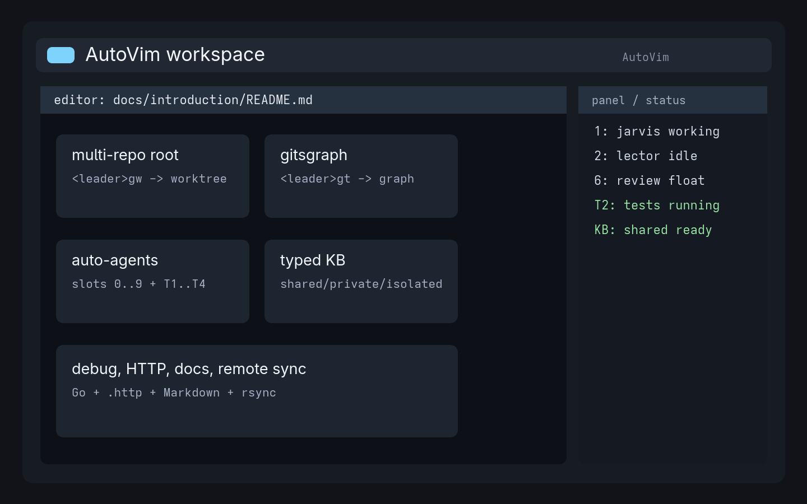

## Core Ideas

AutoVim is built around four ideas:

- **Workspace-native navigation.** Repositories and worktrees are first-class targets, not folders you manually `cd` into and recover from.
- **Cross-repo visibility.** Git history can be browsed across many repositories from one panel, while linked worktrees collapse back to their common Git history.
- **Persistent agent identity.** Agents have names, roles, working directories, model preferences, KB scope, grants, tasks, and status.
- **Durable shared memory.** Knowledge bases are typed and file-backed, so agents can share conventions, ADRs, playbooks, research notes, or operational runbooks across sessions.

## Multi-Repo And Multi-Worktree Workflow

AutoVim ships with a custom worktree workflow through `worktree.nvim`. It is designed for both normal Git repositories and bare-repo layouts with sibling worktrees.

Typical usage:

| Action | Usage |
|---|---|
| Pick a worktree | `<leader>gw` |
| Return to the original root | `<leader>gW` |
| Add a worktree | `<leader>gA` |
| Remove a worktree safely | `<leader>gR` |
| Clone into a bare-plus-worktree layout | `<leader>gC` |
| Initialize a new project layout | `<leader>gc` |

Worktree switches update the global cwd, refresh the file explorer, preserve per-worktree sessions, and restart configured workspace LSPs such as `gopls`, `vtsls`, and `tsserver`. That keeps diagnostics, navigation, and editor state aligned with the worktree you are actually editing.

For mirrored projects, `auto-agents.nvim` adds a second layer: `project import` can copy agent definitions from another project path while preserving the same KB root. This is useful when the same logical project appears as multiple clones, remote mirrors, or worktrees and you do not want agent notes to fragment.

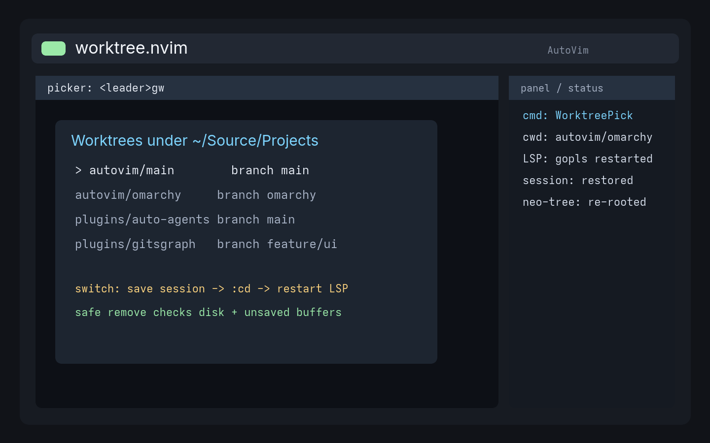

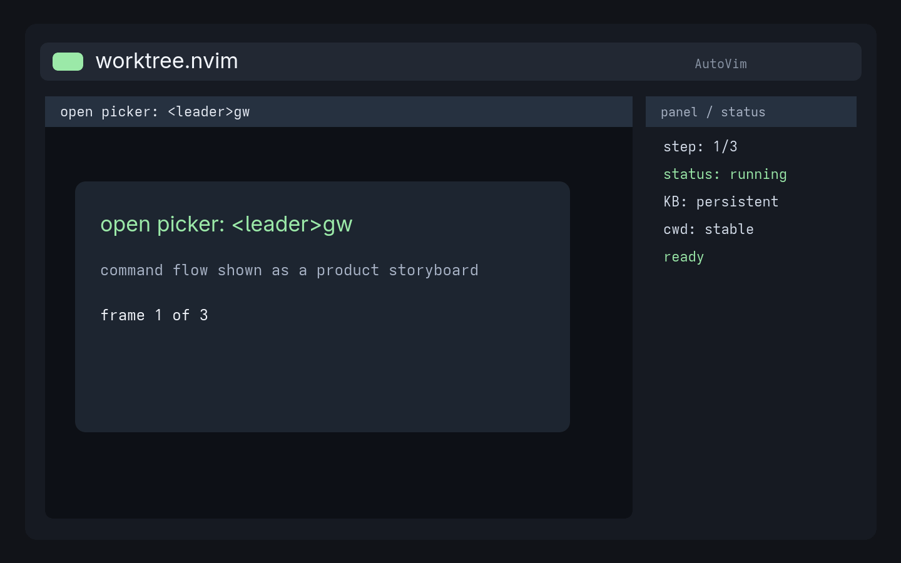

## Multi-Repo Git Graph

AutoVim uses `gitsgraph.nvim`, a custom multi-repo dashboard built on top of `gitgraph.nvim`.

Open it with `<leader>gt` or `:GitsGraph`. The panel has three working areas:

| Pane | Purpose |
|---|---|
| Repo picker | Lists discovered repositories under the saved root. |
| Graph | Shows the selected repo history with the underlying Git graph renderer. |
| Preview | Follows the selected commit with `git show --stat`. |

The important specialization is worktree awareness. `gitsgraph.nvim` deduplicates linked worktrees by their common Git directory, so five worktrees for one project show as one repository row with a unified history. Pressing `<CR>` opens a full commit diff in a float instead of taking over the editor with a tab.

Common controls:

| Action | Usage |
|---|---|
| Toggle graph | `<leader>gt` |
| Select repo 1-9 | `1` through `9` in the picker |
| Cycle panes | `<Tab>` / `<S-Tab>` |
| Fetch selected repo | `f` |
| Fetch all repos | `F` |
| Rescan root | `r` or `:GitsGraphRefresh` |
| Set graph root | `:GitsGraphSetRoot [dir]` |

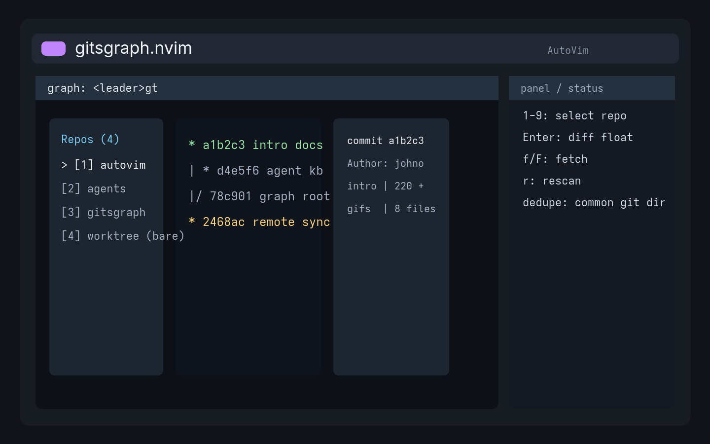

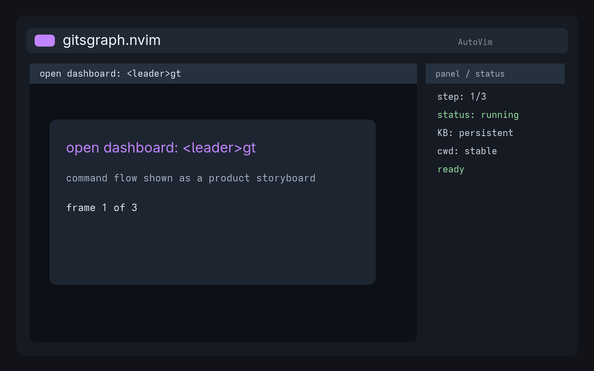

## Auto-Agent Panel

The custom `auto-agents.nvim` panel replaces a single assistant terminal with a multi-slot orchestration surface.

| Slot range | Role |
|---|---|
| `0` | Admin REPL for managing agents, projects, KBs, resources, and terminals. |
| `1` through `5` | Main right-side agent panel, one window with swapped buffers. |
| `6` through `9` | Sub-agent floats for temporary helpers or side-by-side review passes. |
| `T1` through `T4` | Shared playground terminals mapped to `F1` through `F4`. |

Useful entry points:

| Action | Usage |
|---|---|
| Toggle panel | `<F5>` or `<leader>ac` |
| Open navigation dock | `<F6>` or `<F12>` |
| Focus admin | `<leader>a0` |
| Focus agent slot | `<leader>a1` through `<leader>a9` |
| Manage project config | `<leader>ap` |
| Send to playground terminal | `:AutoAgentsTermSend <slot> <text>` |

Each configured agent persists in TOML with fields such as `slot`, `kind`, `name`, `title`, `role`, `cwd`, `cmd`, `model`, `kb_scope`, `allowed_paths`, `manager`, and `bottom_margin`. The panel can also show self-reported agent status: `idle`, `waiting`, or `working`.

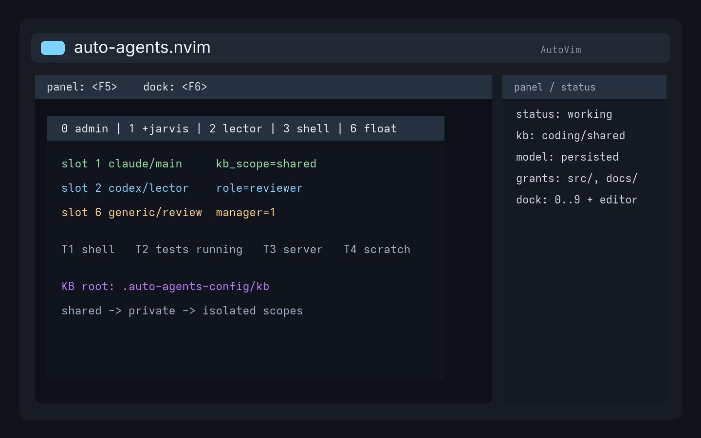

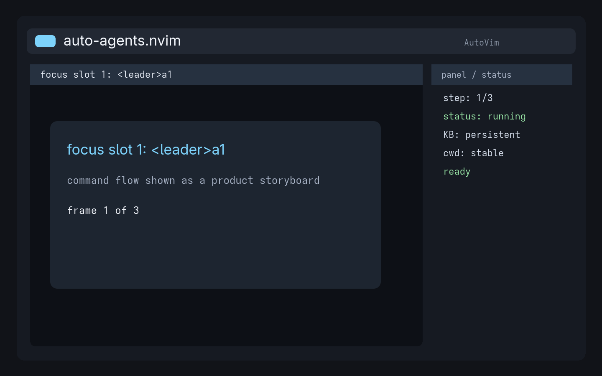

## Persistent Knowledge Base

Every agent can be connected to a typed, file-backed KB. The canonical schema is the KB root's `AGENTS.md`, and agents receive environment variables that tell them what they can read and where they should write.

Supported KB types:

| Type | Use |
|---|---|
| `coding` | Codebase conventions, ADRs, review playbooks, implementation notes. |
| `wiki` | Durable interlinked knowledge and long-term notes. |
| `research` | Papers, hypotheses, experiments, and synthesis. |
| `ops` | Alerts, runbooks, incidents, and postmortems. |
| `general` | Minimal living KB when the structure should emerge over time. |
| `custom` | A user-supplied schema document copied into the KB contract. |

KB scope is per agent:

| Scope | Reads | Writes |
|---|---|---|
| `shared` | `kb/shared` plus all agent notes | `kb/shared` |
| `private` | `kb/shared` plus that agent's notes | `kb/agents/<name>` |
| `isolated` | only that agent's notes | `kb/agents/<name>` |

The `shared` scope is what enables persistent knowledge sharing between agents. A reviewer can write a convention, a builder can read it later, and a manager slot can keep an initiative summary without relying on terminal scrollback.

## Supported Agent Types

AutoVim currently supports these auto-agent kinds:

| Kind | Default command | Typical use |
|---|---|---|
| `claude` | `claude` | Claude Code sessions with optional editor diff-review bridge. |
| `codex` | `codex` | OpenAI Codex CLI sessions. |
| `gemini` | `gemini` | Google Gemini CLI sessions. |
| `copilot` | `gh copilot` | GitHub Copilot CLI workflows. |
| `generic` | configured `cmd` or `$SHELL` | Custom CLIs, shells, or homegrown agent tools. |

Kinds can be overridden per slot with `cmd = [...]`. Claude, Codex, and Gemini can also receive a persisted `model` preference, which is applied on the next spawn.

## Admin Panel

Slot 0 is the low-level control surface. It is intentionally text-based so agents and humans can both use it.

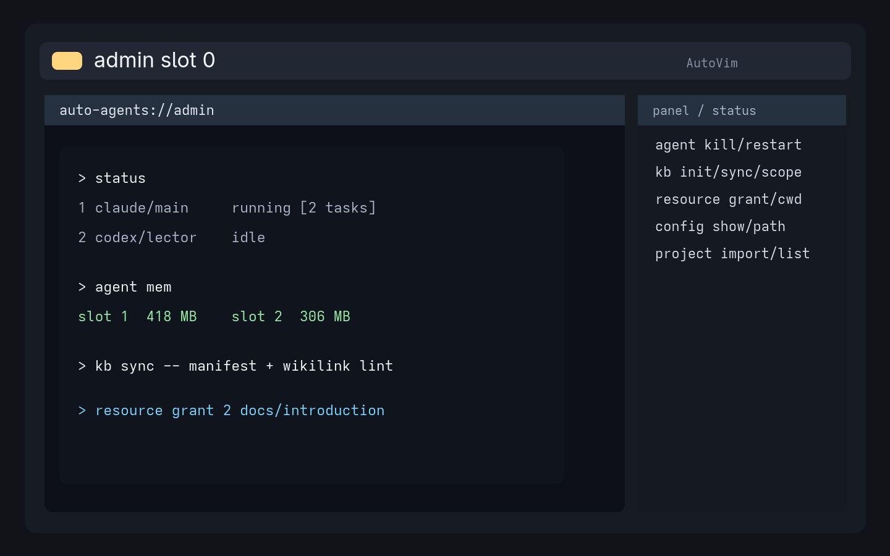

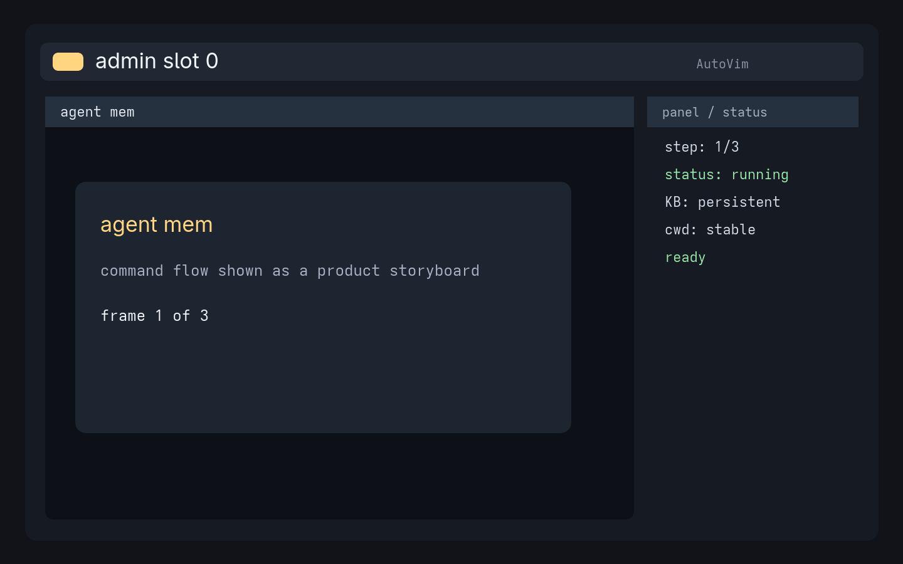

High-value admin commands:

| Area | Commands |
|---|---|
| Agent lifecycle | `agent list`, `agent add`, `agent edit <N>`, `agent kill <N>`, `agent restart <N>`, `agent move <from> <to> [--swap]` |
| Agent operations | `agent send <N> <text>`, `agent attach <N> [paths...]`, `agent task add <N> <text>`, `agent task done <N> <index>`, `agent mem` |
| KB management | `kb init <type>`, `kb ingest`, `kb ingest --attach <N>`, `kb sync`, `kb scope <N>`, `kb new <relative>`, `kb open <relative>`, `kb tail` |
| Resource management | `resource grant <N> <path>`, `resource revoke <N> <path>`, `resource cwd <N> [path]`, `resource manager set <S> <M>`, `resource list [N]` |
| Project config | `project init`, `project import`, `project remove`, `project list`, `project show` |
| Runtime config | `config show`, `config path`, `config save`, `config reset` |
| Playground terminals | `term focus <N>`, `term send <N> <text>`, `term list`, `term kill <N>`, `term hide` |

The admin panel also has interactive wizards for `agent add`, `agent edit`, `kb new`, `kb scope`, and `project import`. Append `?` to any verb, such as `kb init ?`, to open contextual help.

## Other Features Worth Mentioning

AutoVim includes several adjacent tools that fit the same workspace model:

| Feature | Usage |
|---|---|
| Remote sync | `<leader>rp` pull, `<leader>rd` drift check, `<leader>rs` push, `<leader>rS` force push, `<leader>rc` remote command, `<leader>rl` log. |
| Go debugging | `<leader>dt` debug test, `<leader>dm` debug main, `<leader>dD` doctor, `<leader>dN` / `<leader>dM` scaffold launch configs. |
| HTTP collections | `<leader>Rs` scaffold `.rest/`, `<leader>Rn` new scratch request, `<leader>Rr` run, `<leader>Rl` replay, `<leader>Ra` run all. |
| Markdown panes | `<leader>m1`, `<leader>m2`, `<leader>m3`, `<leader>ma`, `<leader>ms`, `<leader>md` open or restore rendered docs. |
| SQL terminal | `<C-q>` toggles `lazysql` in a persistent float. |
| Playground terminals | `F1` through `F4` keep shared shells alive across worktree changes. |
| Theme integration | The `omarchy` branch follows the active Omarchy theme and hot-reloads Neovim colors. |

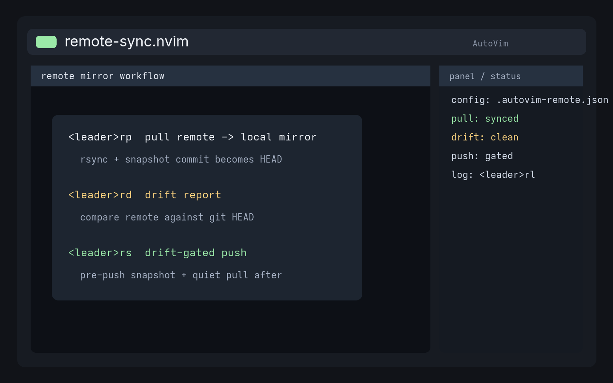

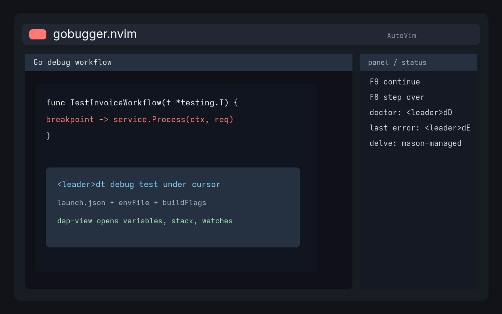

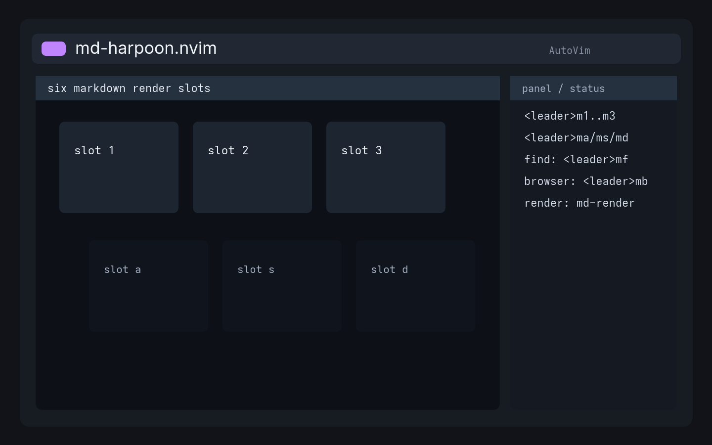

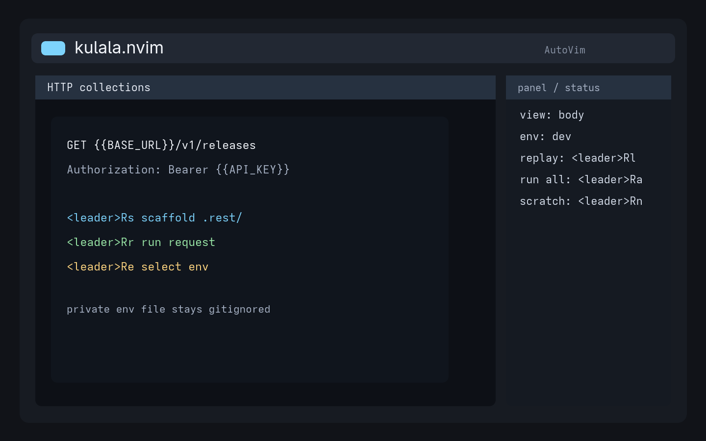

## Screenshot And GIF Assets

The image assets live beside this document so the introduction can be moved or published as a self-contained folder. Static screenshot-style PNGs are in `assets/images/`; animated GIF demos are in `assets/gifs/`; the generator is [assets/build-assets.sh](assets/build-assets.sh).

These assets are illustrative visual aids generated from local storyboards, not live captures of an interactive Neovim session. The placeholder files under [placeholders/](placeholders/) are ready-to-open sample buffers for a future live capture pass.
